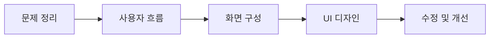

# UI/UX · 웹디자이너

사용자가 쉽게 이해하고 사용할 수 있는
화면 흐름과 구조를 고민합니다.

UI/UX 디자인과 웹디자인을 중심으로
화면 구성과 사용자 경험을 공부하고 있습니다.

`UI/UX` · `웹디자인` · `Figma` · `반응형 웹`

---

## 소개

| 구분    | 내용                    |
| ----- | --------------------- |
| 디자인   | UI/UX 디자인, 웹디자인       |
| 화면 설계 | 사용자 흐름, 와이어프레임, 프로토타입 |
| 웹 이해  | HTML, CSS 기초          |
| 관심 분야 | 반응형 웹, 인터랙션, 사용자 경험   |

---

## 작업 과정

---

## 대표 프로젝트 · 작심농장

습관 기록 과정을
직관적인 기록 화면 중심으로 구성한 UI/UX 프로젝트입니다.

사용자가 기록 현황을 쉽게 확인할 수 있도록
단순한 화면 흐름과 기록 관리 구조를 중심으로 디자인했습니다.

### 작업 내용

* 습관 기록 화면 구성
* 연속 기록 UI
* 기록 관리 화면
* 알림 설정 화면
* 모바일 화면 디자인

> 식물 성장 및 상태 변화 기능은 아이디어 단계로 정리했습니다.

---

## 디자인 구조

---

## 현재 학습 중

* 반응형 웹
* 인터랙션 UI
* 디자인 시스템
* 웹 접근성

---

## Contact

| 구분        | 링크                                                |
| --------- | ------------------------------------------------- |
| Portfolio | https://uiux0718.github.io/portfolio-2026/        |
| Email     | [banrose12@naver.com](mailto:banrose12@naver.com) |
