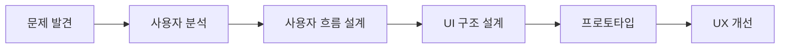
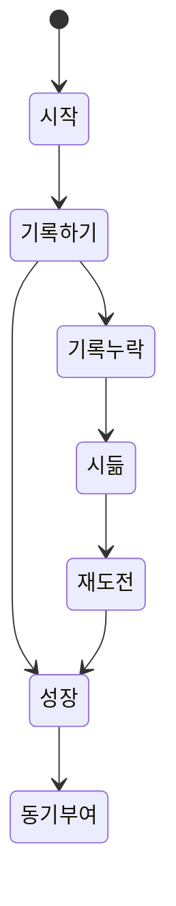
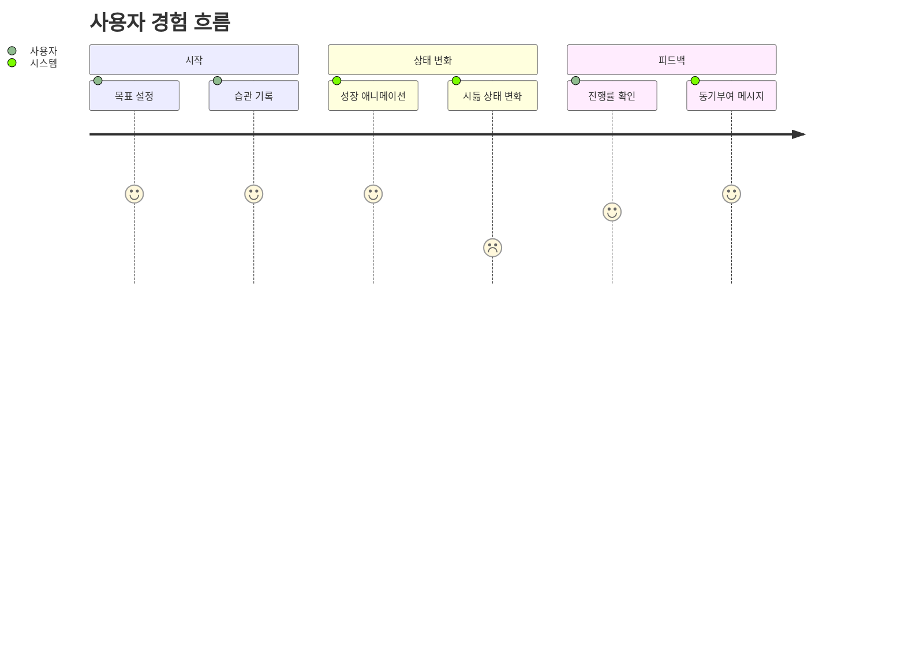
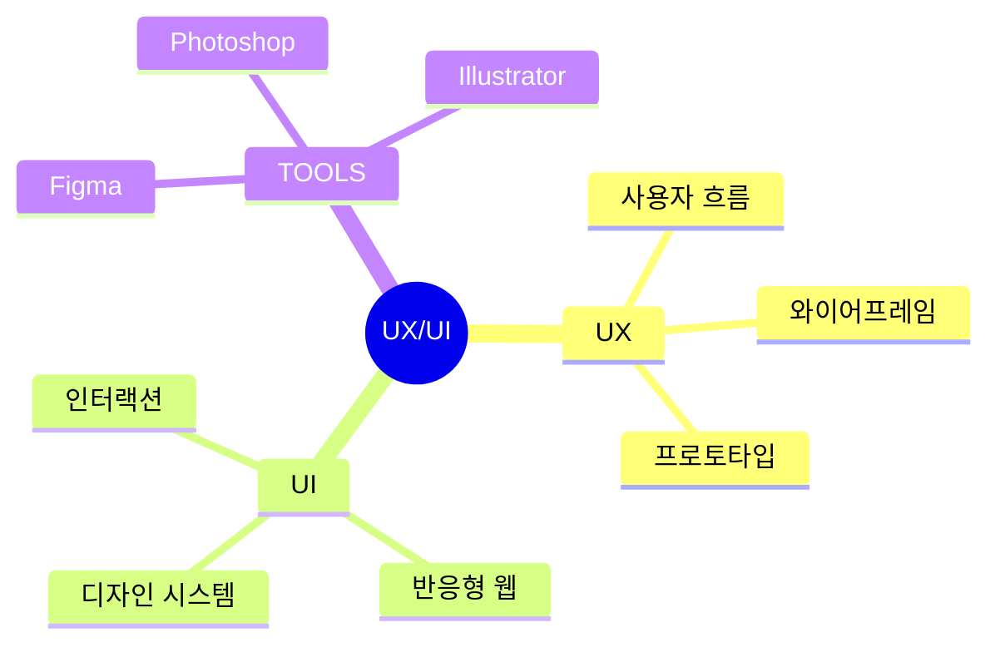
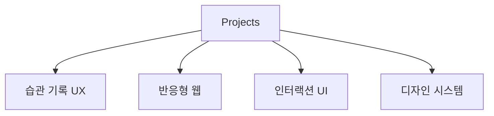
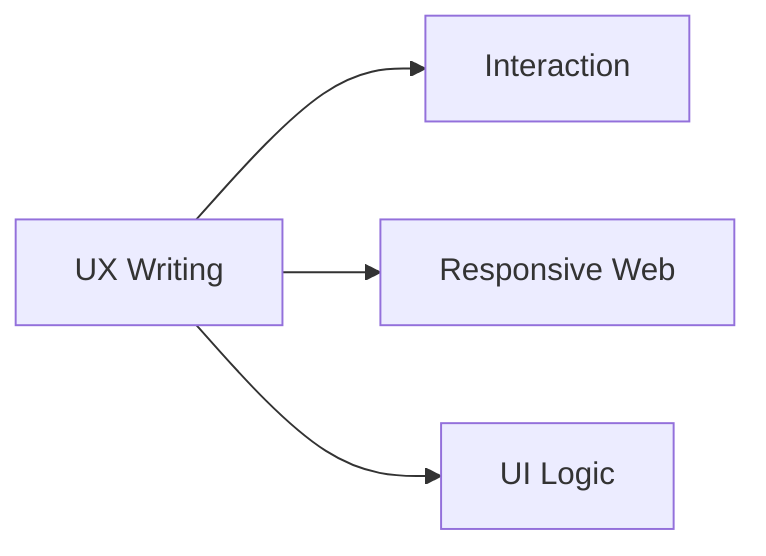

# 👋 UX/UI 디자이너

> 사용자 흐름과 인터랙션 구조를 설계합니다.

사용자가 길을 잃지 않는 정보 구조와
직관적인 사용자 경험을 중요하게 생각합니다.

기획 → UX 설계 → UI 디자인 → 프로토타입 구현까지
직접 연결하며 사용자 경험을 고민합니다.

---

# 🧠 UX 사고 흐름

---

# 🌱 대표 프로젝트 · 작심농장

> 습관 지속 과정을 성장과 시듦 상태 변화로 시각화한 UX/UI 프로젝트

---

# 👤 사용자 경험 흐름

---

# 🛠 작업 영역

---

# 📂 프로젝트 방향

---

# 📚 현재 학습 중

---

# 🌐 Portfolio

[포트폴리오 바로가기](https://uiux0718.github.io/portfolio-2026/)

# 📧 Contact

[banrose12@naver.com](mailto:banrose12@naver.com)
