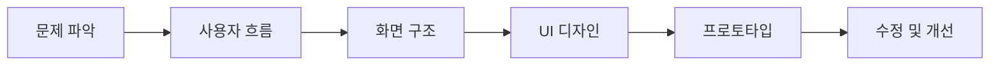
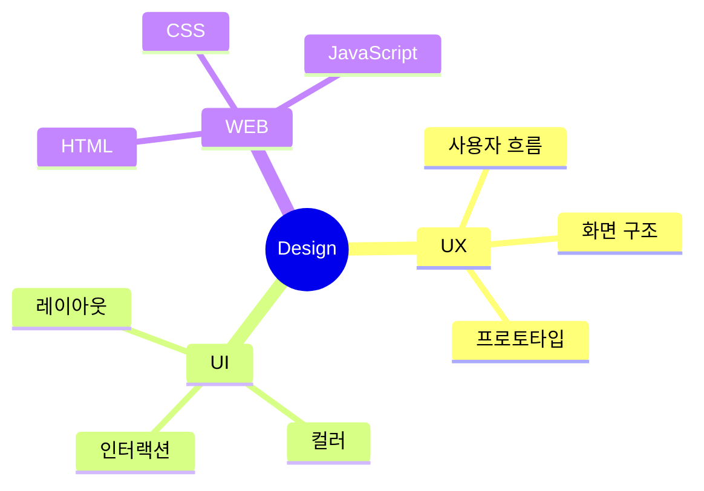

# UI/UX · 웹디자이너

사용자가 쉽게 이해하고 사용할 수 있는
화면 흐름과 인터페이스를 고민합니다.

`UI/UX` · `웹디자인` · `반응형 웹` · `HTML` · `CSS` · `JavaScript`

---

## 소개

| 구분    | 내용                    |
| ----- | --------------------- |
| 디자인   | UI/UX 디자인, 웹디자인       |
| 화면 설계 | 사용자 흐름, 와이어프레임, 프로토타입 |
| 웹 구현  | HTML, CSS, JavaScript |
| 관심 분야 | 반응형 웹, 인터랙션, 사용자 경험   |

---

## 작업 과정

---

## 대표 프로젝트 · 작심농장

습관 기록 과정을
성장하는 식물 컨셉으로 표현한 UI/UX 프로젝트입니다.

| 작업 내용           |
| --------------- |
| 습관 기록 화면 구성     |
| 성장 상태 인터페이스     |
| 사용자 흐름 기반 화면 설계 |
| 모바일 반응형 UI 구현   |

> 시듦 상태와 감정 피드백 기능은 현재 아이디어 및 설계 단계입니다.

---

## 디자인 구조

---

## 현재 학습 중

* 반응형 웹
* 인터랙션 UI
* 디자인 시스템
* JavaScript

---

## Contact

| 구분        | 링크                                                                                       |
| --------- | ---------------------------------------------------------------------------------------- |
| Portfolio | [https://uiux0718.github.io/portfolio-2026/](https://uiux0718.github.io/portfolio-2026/) |
| Email     | [banrose12@naver.com](mailto:banrose12@naver.com)                                        |
